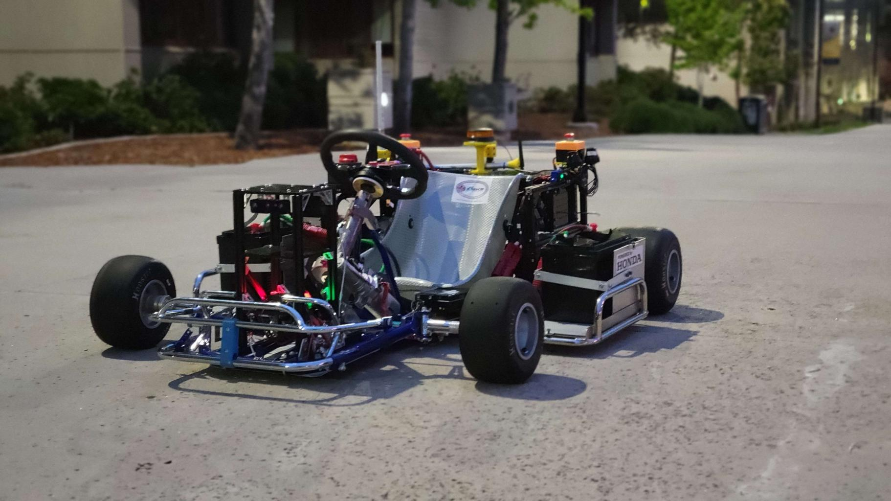

# Data Fusion: Extracting IMU and GNSS Insights from Hardware Devices

## Project Team
 

Michael P. Ruddy

Undergraduate Senior, University of California San Diego

mrud2001@gmail.com

## Motivation
The motivation behind this project stems from the increasing demand for high-speed and high-accuracy data in autonomous vehicles, particularly in the field of autonomous racing. To compete at high speeds and navigate complex race tracks without human intervention, autonomous race cars require robust perception, decision-making, and control capabilities. In order to achieve optimal performance, these vehicles rely on various sensors, including cameras, IMUs, lidar, radar, and GNSS.

The objective of this project is to focus on data fusion, specifically extracting and analyzing IMU and GNSS insights from hardware devices(Point One Navigation Atlas,P1SDK) to enhance the performance and navigation accuracy of Triton AI's autonomous go-karts. The research is centered around Triton AI's three vehicles: a full-size go-kart, a 1/5 scale go-kart, and a 1/10 scale go-kart, which utilize IMU and GNSS data from hardware units provided by Point One Navigation.

## Project Overview
This project’s focus was the research and future development of Triton AI’s three vehicles: a full size, 1/5 scale, and 1/10
scale which rely on IMU and GNSS data from hardware units designed by Point One Navigation. I configured and
established a reliable connection to the Atlas unit for the full size go kart. Additionally IMU data was extracted from the
P1SDK unit, which is used in the ⅕ scale kart, to be analyzed and compared with the other IMUs at our disposal. Currently
the P1SDK is being utilized only for GNSS data on the ⅕ kart, working in tandem with a separate IMU unit; hence it is
important to find out which setup of the resources available would provide the best performance and reliability benefits.

## [Project Showcase](https://drive.google.com/file/d/1XMN0SFqJnMZiCo4YY1O-weOlYEP0sotJ/view?usp=sharing) 

## Documentation
[Atlas Documentation](Atlas+User+Guide+1.5.pdf) 

[P1SDK Documentation](Point%20One%20Standard%20Dev%20Kit%20User%20Manual.pdf)

[Fusion Engine Message Documentation](FusionEngine%20Message%20Specification%20v0.17.pdf)

## Class Materials
[Project Specification](Project%20Spec%20CSE%20145%20(1).pdf)

[Project Update](update%20presentation.pdf)

[Milestone Report](Milestone%20Report%20(1).pdf)

[Final Presentation](Oral%20Project%20Update%20(1).pdf)

[Project Report](https://github.com/MichaelRuddy/CSE145/blob/main/Final%20Project%20Report.docx%20(1).pdf) 

